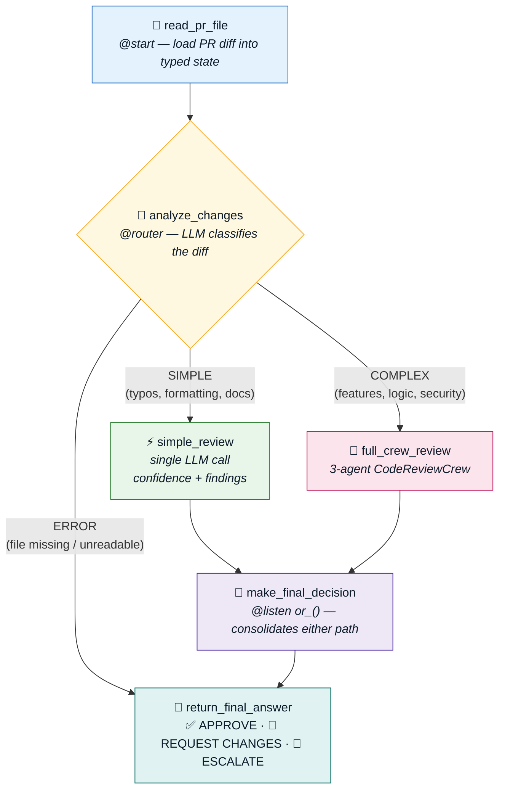
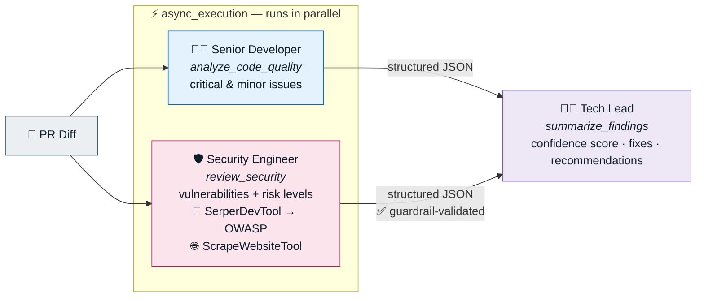

# 🤖 Multi-Agent Automated Code Review — Built with CrewAI


An end-to-end **multi-agent system that automatically reviews pull requests** — analyzing code quality, hunting for security vulnerabilities (with live OWASP research), and issuing an approve / request-changes / escalate decision.

Built across three progressive assignments from the [Design, Develop, and Deploy Multi-Agent Systems with CrewAI](https://www.deeplearning.ai/courses/design-develop-and-deploy-multi-agent-systems-with-crewai/) course by **DeepLearning.AI**, taught by **João Moura** (Co-founder & CEO of CrewAI). Each assignment layers on production concerns: from agent design → to guardrails and memory → to intelligent routing, parallelism, and observability.

---

## 🏗️ System Architecture

The final system (A3) is a **CrewAI Flow** that routes each pull request by complexity — cheap LLM calls for trivial diffs, a full multi-agent crew for anything that matters:



### Inside the crew — three specialists, two working in parallel



**Why this design matters:** routing avoids burning multi-agent token budgets on trivial diffs, parallel task execution roughly halves crew latency, and every agent output is schema-enforced so downstream steps never parse free-form text.

---

## 📚 The Three Assignments

### A1 — Multi-Agent Automatic Code Review
> *Foundations: agents, tasks, tools, and orchestration*

- Designed a three-agent crew — **Senior Developer**, **Security Engineer**, **Tech Lead** — each with a focused role, goal, and backstory
- Equipped the Security Engineer with **SerperDevTool** (search scoped to `owasp.org`) and **ScrapeWebsiteTool** so security findings are grounded in live best-practice references, not just model memory
- Enforced structured JSON outputs per task (`critical_issues`, `security_vulnerabilities`, `risk_level`, …)
- Used **task context chaining** so the Tech Lead synthesizes both specialists' findings into a final verdict

### A2 — Adding Production-Grade Functionality
> *Reliability: guardrails, hooks, memory, and configuration hygiene*

- **Pydantic output schemas** (`output_json`) guarantee parseable, consistent agent responses
- Two custom **guardrails**:
  - `security_review_output_guardrail` — validates risk levels against allowed categories and checks `highest_risk` actually matches the most severe finding
  - `review_decision_guardrail` — ensures the final decision contains an actionable keyword (`approve` / `request changes` / `escalate`)
- A **before-kickoff hook** (`read_file_hook`) injects the PR diff into crew inputs before any agent runs
- **Crew memory** retains context across successive reviews
- **YAML-based configuration** (`agents.yaml`, `tasks.yaml`) cleanly separates prompts from orchestration code

### A3 — Building the Automatic Code Review Flow
> *Scale: routing, parallelism, state, persistence, and observability*

- `PRCodeReviewFlow` built on CrewAI's **Flow API** with a typed Pydantic `ReviewState` (PR content, errors, results, token usage, final answer)
- An LLM-powered **`@router`** classifies each PR `SIMPLE` / `COMPLEX` / `ERROR` and dispatches accordingly
- Quality and security tasks run **in parallel** (`async_execution=True`) on the complex path
- `or_()` conditional listeners consolidate whichever path ran; errors short-circuit safely to the final answer
- **`@persist` state persistence** and **tracing** for full observability — flow state exported to `flow_state.json` for token/cost analysis
- Packaged as a proper **CrewAI CLI project** (`crewai run`, `crewai flow plot` → interactive HTML flow diagram)

---

## 📁 Repository Structure

```
├── A1 Multi-Agent Automatic Code Review/      # Crew fundamentals (notebook)
├── A2 Adding functionalities .../             # Guardrails, hooks, memory, YAML config
└── A3 Building an Automatic Code Review Flow/
    └── code_review_flow/                      # Full CrewAI CLI project
        └── src/code_review_flow/
            ├── main.py                        # PRCodeReviewFlow (router + listeners)
            └── crews/code_review_crew/
                ├── crew.py                    # Agents, tasks, parallel execution
                ├── config/                    # agents.yaml · tasks.yaml
                └── guardrails/                # Custom output validators
```

---

## 🧰 Tech Stack

| Tool | Role |
|---|---|
| [CrewAI](https://www.crewai.com/) (Crews + Flows) | Multi-agent orchestration, routing, persistence |
| OpenAI **GPT-4o-mini** | LLM powering agents, router, and direct calls |
| [Pydantic](https://docs.pydantic.dev/) | Typed flow state & enforced output schemas |
| [SerperDevTool](https://docs.crewai.com/en/tools/search-research/serperdevtool) / [ScrapeWebsiteTool](https://docs.crewai.com/en/tools/web-scraping/scrapewebsitetool) | Live OWASP research for the security agent |
| Python 3.11 · Jupyter · uv | Development & packaging |

## 💼 Skills Demonstrated

**Multi-agent design** — role/goal/backstory engineering, task decomposition, context chaining, tool integration
**LLM engineering** — structured outputs, guardrail validation, prompt design for routing and synthesis
**Systems thinking** — cost-aware routing, parallel execution, typed state management, error short-circuiting
**Production readiness** — persistence, tracing, token/cost analysis, YAML config separation, CLI project packaging

---

## 🎓 Course

- **Course:** [Design, Develop, and Deploy Multi-Agent Systems with CrewAI](https://www.deeplearning.ai/courses/design-develop-and-deploy-multi-agent-systems-with-crewai/)
- **Platform:** DeepLearning.AI
- **Instructor:** João Moura — Co-founder & CEO, CrewAI
