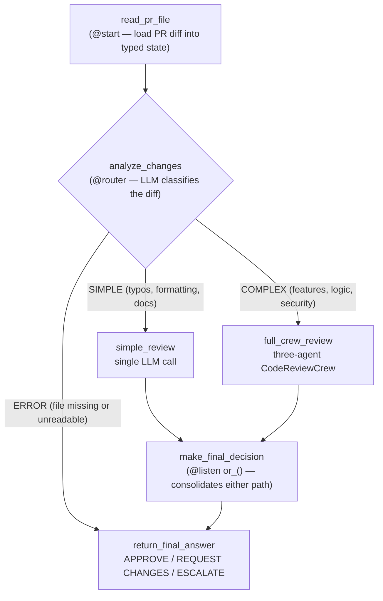
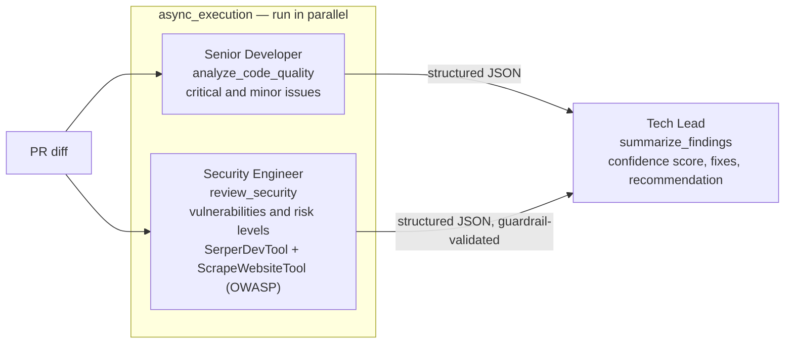

# Multi-Agent Automated Code Review with CrewAI

A multi-agent system that reviews pull requests end to end: it analyzes code quality, checks for security vulnerabilities against live OWASP references, and produces a final decision — approve, request changes, or escalate.

The project was built across three progressive assignments from [Design, Develop, and Deploy Multi-Agent Systems with CrewAI](https://www.deeplearning.ai/courses/design-develop-and-deploy-multi-agent-systems-with-crewai/) (DeepLearning.AI, taught by João Moura, co-founder and CEO of CrewAI). Each assignment adds a layer of production concerns: agent design first, then guardrails and memory, then routing, parallelism, and observability.

## Architecture

The final system (assignment A3) is a CrewAI Flow that routes each pull request by complexity. Trivial diffs are handled with a single inexpensive LLM call; substantive changes are dispatched to a full multi-agent crew.



On the complex path, the crew consists of three specialist agents. The first two run concurrently:



Three design decisions drive the system: complexity-based routing avoids spending multi-agent token budgets on trivial diffs, parallel task execution roughly halves crew latency, and schema-enforced outputs mean downstream steps never parse free-form text.

## Assignments

### A1 — Multi-Agent Automatic Code Review

Foundations: agents, tasks, tools, and orchestration.

- A three-agent crew — Senior Developer, Security Engineer, and Tech Lead — each with a focused role, goal, and backstory
- The Security Engineer uses SerperDevTool (search scoped to `owasp.org`) and ScrapeWebsiteTool, grounding security findings in current best-practice references rather than model memory alone
- Structured JSON outputs per task (`critical_issues`, `security_vulnerabilities`, `highest_risk`, etc.)
- Task context chaining, so the Tech Lead synthesizes both specialists' findings into a final verdict

### A2 — Adding Production-Grade Functionality

Reliability: guardrails, hooks, memory, and configuration hygiene.

- Pydantic output schemas (`output_json`) guarantee parseable, consistent agent responses
- Two custom guardrails:
  - `security_review_output_guardrail` validates risk levels against allowed categories and verifies that `highest_risk` matches the most severe finding
  - `review_decision_guardrail` ensures the final decision contains an actionable keyword (approve, request changes, or escalate)
- A before-kickoff hook (`read_file_hook`) injects the PR diff into crew inputs before any agent runs
- Crew memory retains context across successive reviews
- YAML-based configuration (`agents.yaml`, `tasks.yaml`) separates prompts from orchestration code

### A3 — Building an Automatic Code Review Flow

Scale: routing, parallelism, state, persistence, and observability.

- `PRCodeReviewFlow` built on CrewAI's Flow API with a typed Pydantic `ReviewState` (PR content, errors, results, token usage, final answer)
- An LLM-powered `@router` classifies each PR as SIMPLE, COMPLEX, or ERROR and dispatches accordingly
- Quality and security tasks run in parallel (`async_execution=True`) on the complex path
- `or_()` conditional listeners consolidate whichever path ran; errors short-circuit safely to the final answer
- State persistence via `@persist` and tracing for observability, with flow state exported to `flow_state.json` for token and cost analysis
- Packaged as a standard CrewAI CLI project (`crewai run`; `crewai flow plot` generates an interactive HTML flow diagram)

## Project Structure

```
code_review_flow/                          # CrewAI CLI project
├── pyproject.toml                         # Project metadata and dependencies
├── uv.lock
└── src/code_review_flow/
    ├── main.py                            # PRCodeReviewFlow (router + listeners)
    ├── utils.py
    ├── tools/
    │   └── custom_tool.py
    └── crews/code_review_crew/
        ├── crew.py                        # Agents, tasks, parallel execution
        ├── config/
        │   ├── agents.yaml                # Agent roles, goals, backstories
        │   └── tasks.yaml                 # Task descriptions and outputs
        └── guardrails/
            └── guardrails.py              # Custom output validators
```

## Tech Stack

| Component | Role |
|---|---|
| [CrewAI](https://www.crewai.com/) (Crews and Flows) | Multi-agent orchestration, routing, persistence |
| OpenAI GPT-4o-mini | LLM powering agents, the router, and direct calls |
| [Pydantic](https://docs.pydantic.dev/) | Typed flow state and enforced output schemas |
| [SerperDevTool](https://docs.crewai.com/en/tools/search-research/serperdevtool), [ScrapeWebsiteTool](https://docs.crewai.com/en/tools/web-scraping/scrapewebsitetool) | Live OWASP research for the security agent |
| Python 3.11, Jupyter, uv | Development and packaging |

## Course

- **Course:** [Design, Develop, and Deploy Multi-Agent Systems with CrewAI](https://www.deeplearning.ai/courses/design-develop-and-deploy-multi-agent-systems-with-crewai/)
- **Platform:** DeepLearning.AI
- **Instructor:** João Moura, co-founder and CEO of CrewAI
